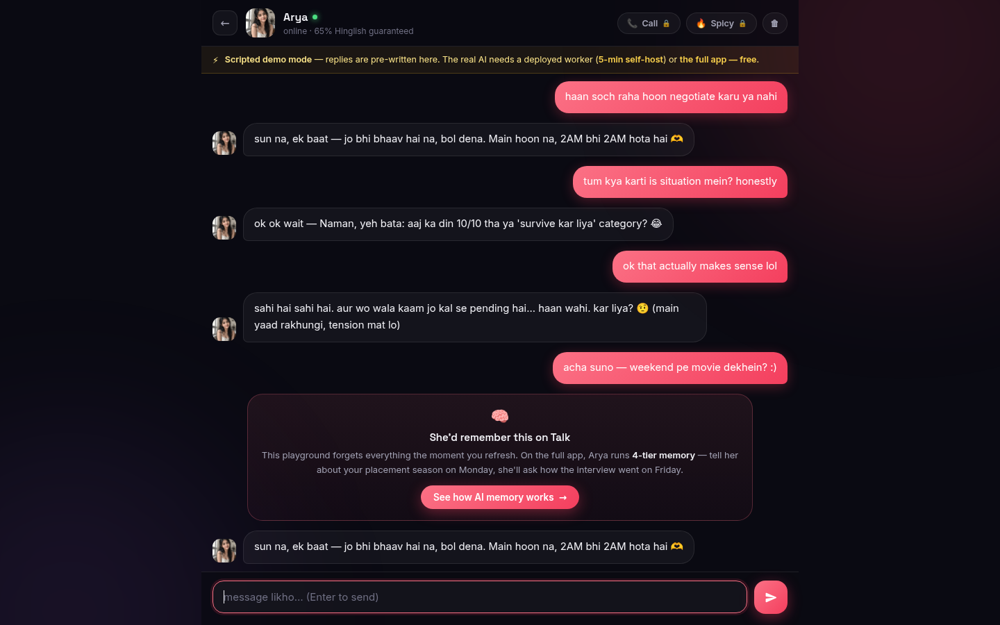

<div align="center">


# Talk AI Companion Playground

**Free &amp; open-source AI companion chat UI — 6 desi personalities, Hinglish + English, zero sign-up.**

*The open-source demo playground of [Main Talk AI Companion](https://talkaicompanion.com?utm_source=github&utm_medium=readme) — India's AI companion app with memory, voice calls &amp; stories.*

[](LICENSE)
[](https://workers.cloudflare.com)
[](docs/CHARACTER-CARDS.md)
[](CONTRIBUTING.md)

<!-- OWNER NOTE: after `wrangler deploy`, replace the "Live demo" link below with your
     default workers.dev URL (no custom domain needed):
     https://talk-ai-companion-playground.<your-subdomain>.workers.dev -->
[Live demo →]( https://talk-ai-companion-playground.payment-6bd.workers.dev) · [Self-host in 5 min](SELF-HOST.md) · [Meet all 11 companions](https://talkaicompanion.com/companions?utm_source=github&utm_medium=readme)

</div>

---



> Chatting with **Arya** — the 2AM bestie. Streaming replies, Hinglish by default, and a not-so-subtle nudge toward the real thing 😄

## What is this?

A **single-file chat UI** + a **~300-line Cloudflare Worker** that lets anyone chat with 6 AI companion characters for free — no sign-up, no OTP, no API key needed from the user. It's the open-source teaser for [**Talk**](https://talkaicompanion.com?utm_source=github&utm_medium=readme), an Indian AI companion app.

The playground is intentionally the "free taste": conversations are SFW, memory resets on refresh, voice calls are locked. When you want the real thing — the UI [teases you toward it](#the-funnel) at just the right moments. 😉

### The roster

| | Companion | Vibe | Hinglish |
|---|---|---|---|
|  | **Arya** | your 2AM bestie — gossip, gyaan &amp; gussa | 65% |
|  | **Aarohi** | high-chemistry — makes you earn every "hmm" | 60% |
|  | **Kabir** | startup bro + gym partner + life coach | 45% |
|  | **Mira** | soft mornings, filmy nights, endless pouts | 55% |
|  | **Noor** | midnight RJ — grades your flirt lines /10 | 50% |
|  | **Ruhi** | padosan from 402 — runs the floor's gossip ledger | 70% |
| 🔒 | +5 more | Gojo Satoru, Rohan, Akansha, Rhea, Rupali | [on Talk →](https://talkaicompanion.com/companions?utm_source=github&utm_medium=readme) |

Every companion ships as a [**Character Card V2**](public/characters/) JSON — the SillyTavern-compatible standard — so you can drop them into other frontends too.

### Playground vs the full app

| | **This playground** | [**Talk**](https://talkaicompanion.com?utm_source=github&utm_medium=readme) |
|---|---|---|
| Price | free forever | 300 free credits **daily** (~50 msgs), packs from ₹29 |
| Sign-up | none (name only — *sirf naam*) | guest mode, no OTP |
| Memory | ❌ dies on refresh | ✅ **4-tier memory** — remembers for weeks ([docs](docs/MEMORY-ARCHITECTURE.md)) |
| Voice calls | 🔒 locked | ✅ live calls, 37 Indian voices, Hinglish-native |
| Companions | 6 | 11 |
| Stories | ❌ | ✅ 5 interactive worlds where choices change endings |
| Spicy mode (18+) | 🔒 locked (SFW only) | ✅ one-time ₹9 unlock |
| Self-host | ✅ MIT, your keys, your rules | hosted PWA |

## ✨ Features

- **Streaming chat** — SSE passthrough, replies appear token-by-token
- **Key rotation out of the box** — put 10 API keys in `API_KEYS` (`key1;key2;key3`), the worker picks one **at random per request** and rotates on 429/401. Rate limits? Distributed.
- **Any OpenAI-compatible backend** — OpenAI, Groq, Together, OpenRouter, your own proxy — just set `API_BASE_URL` + `API_MODEL`
- **Zero-dependency UI** — one `index.html`, no build step, no framework, works on mobile
- **Scripted demo fallback** — no backend? The UI still works with canned replies (great for static hosting + GitHub Pages)
- **Per-IP rate limiting** — default 40 msgs/day, one env var to change
- **SFW by design** — a strict system layer keeps the playground rated-13+; spicy is a locked button, not a jailbreak
- **Character Card V2** — each companion is a standard JSON you can PR improvements to

## 🚀 Quick start

**Option A — deploy to Cloudflare (free tier, ~2 min):**

[](https://deploy.workers.cloudflare.com/?url=https://github.com/NamanSoni78/Talk-AI-Companion-Public)

**Option B — run locally:**

```bash
git clone https://github.com/NamanSoni78/Talk-AI-Companion-Public
cd Talk-AI-Companion-Public
npm install
cp .dev.vars.example .dev.vars   # add your API keys
npm run dev                       # → http://localhost:8787
```

**The only three secrets that matter:**

| Env var | Example | What it does |
|---|---|---|
| `API_KEYS` | `sk-aaa;sk-bbb;sk-ccc` | semicolon-separated keys; one picked **randomly per request**, rotated on failure |
| `API_BASE_URL` | `https://api.openai.com/v1` | any OpenAI-compatible endpoint |
| `API_MODEL` | `gpt-4o-mini` | model name |

Optional: `RATE_LIMIT_PER_DAY` (default 40), `ALLOWED_ORIGINS` (for cross-origin UI hosting).

Full guide — including secrets on Cloudflare, custom domains, and KV-backed rate limiting — in **[SELF-HOST.md](SELF-HOST.md)**.

## 🧠 Adding a companion

Characters are plain JSON ([Character Card V2](docs/CHARACTER-CARDS.md)):

```jsonc
// public/characters/your-character.json
{
  "spec": "chara_card_v2",
  "spec_version": "2.0",
  "data": {
    "name": "Your Character",
    "description": "…", "personality": "…",
    "first_mes": "…", "mes_example": "…",
    "creator_notes": "…", "tags": ["…"]
  }
}
```

Open a PR — the best community characters get added to the roster (and credited). See [CONTRIBUTING.md](CONTRIBUTING.md).

## 🏗️ Architecture

```
 Browser (public/index.html — no build step)
    │  POST /api/chat {companion, name, messages}
    ▼
 Cloudflare Worker (worker.js)
    ├── loads character card (public/characters/*.json)
    ├── wraps in SFW playground system prompt
    ├── picks a random key from API_KEYS  ◄── rotation
    ├── per-IP rate limit (40/day default)
    ▼
 Any OpenAI-compatible API (streaming SSE)
    ▼
 tokens stream straight back to the browser
```

Static assets (`public/`) are served by Workers Static Assets — same domain, no CORS pain, one `wrangler deploy`.

## 🤝 Contributing

PRs welcome — especially **new character cards** (Hinglish personalities preferred 🇮🇳), UI polish, and worker improvements. Read [CONTRIBUTING.md](CONTRIBUTING.md) first; `npm test`-style card validation runs on every PR via GitHub Actions.

## ❓ FAQ

**Is this really free? What's the catch?**
No catch — the repo is MIT. The catch is *emotional*: the playground forgets you on refresh, and the full app doesn't. 😄

**Do users need an API key?**
No. The deployer's keys power the demo. Forkers can plug in their own via env vars — that's the point.

**Why is Spicy mode locked?**
The playground is open source and rated 13+. Spicy (18+) lives on the main app behind a one-time ₹9 unlock. This is by design, not a TODO.

**Can I use the character cards elsewhere?**
Yes — they follow the Character Card V2 spec, so SillyTavern and friends will import them.

**Who made this?**
[Naman Soni](https://github.com/NamanSoni78) — maker of [Talk](https://talkaicompanion.com?utm_source=github&utm_medium=readme). Companion personas by the Talk team.

## 🔞 Adult content notice

This playground is **strictly SFW**. 18+ conversations, explicit content and image generation are not available here — the system layer declines and redirects. Adults looking for Spicy mode can find it on [talkaicompanion.com](https://talkaicompanion.com?utm_source=github&utm_medium=readme) behind age verification.

## 📄 License

[MIT](LICENSE) © Naman Soni. Companion names, personas and artwork belong to [Talk](https://talkaicompanion.com?utm_source=github&utm_medium=readme) and are used here with permission. Gojo Satoru is a fan-inspired parody character; all anime references belong to their respective owners.

---

<div align="center">

**Like the personalities? The full app remembers you, calls you, and never runs out of credits.**

**[ Open Talk — sirf naam → ](https://talkaicompanion.com?utm_source=github&utm_medium=readme_footer)**

*free · no email · no OTP · Hinglish + English*

⭐ Star this repo if it helped you build something.
</div>
